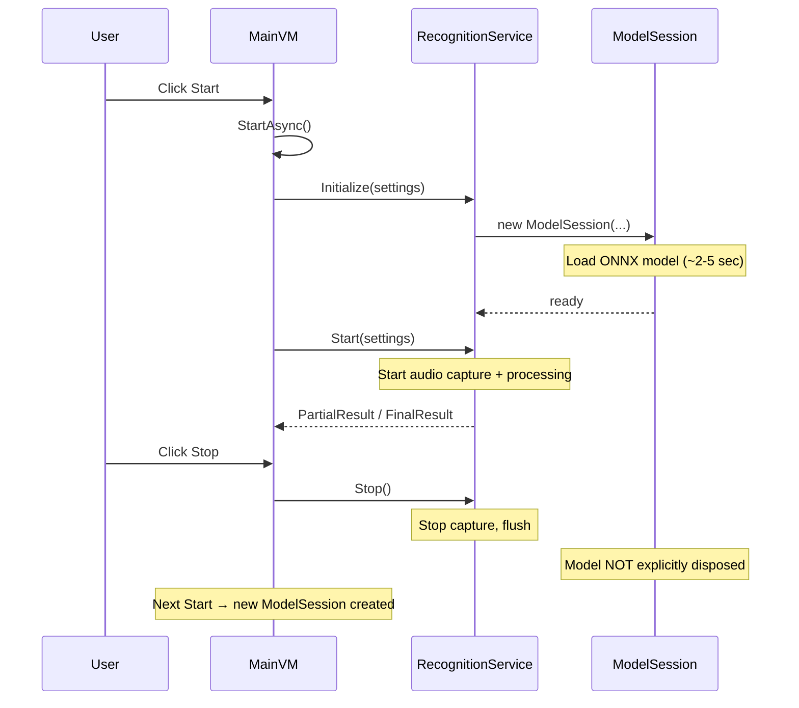
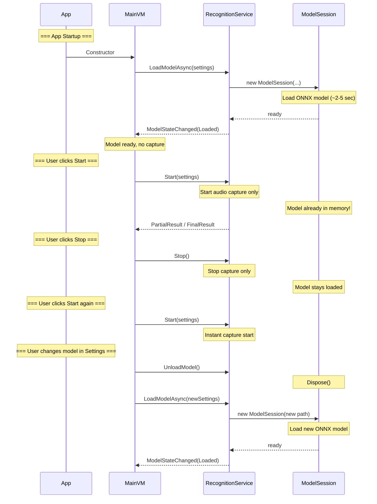
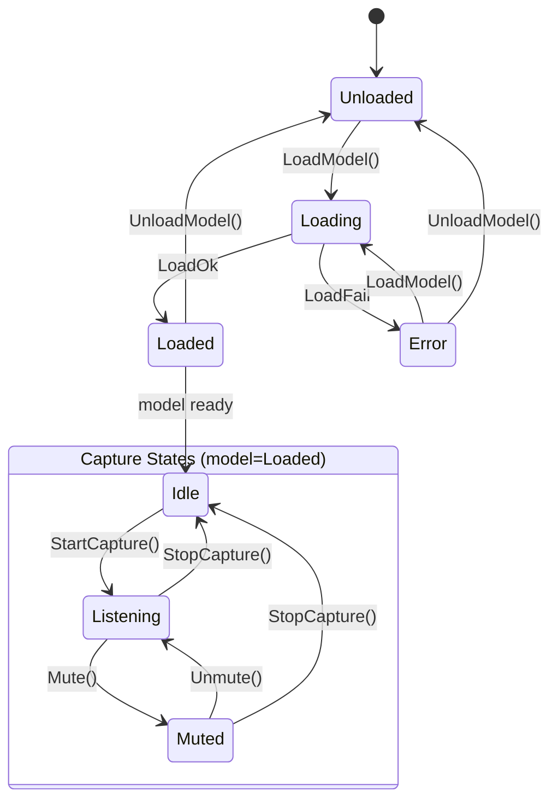

# VoiceType.WinUI — Model Preload & Lazy Capture Plan

**Branch:** `feature/model-preload-lazy-capture`  
**Date:** 2026-07-24  
**Status:** Planning (not implemented)

---

## Цель

Разделить загрузку модели и захват звука так, чтобы:
1. Модель загружалась при старте приложения **без** начала захвата звука
2. Кнопка **Start** — запускает захват звука (модель уже в памяти; если нет — догружает)
3. Кнопка **Stop** — останавливает захват, но **не выгружает** модель
4. Смена модели в настройках → явная перезагрузка модели с индикацией для пользователя
5. Индикатор состояния модели виден всегда

---

## Текущая архитектура (AS-IS)



**Проблемы:**
- `Initialize()` и `Start()` всегда вызываются вместе
- Каждый Stop/Start создаёт новый `ModelSession` (дорого)
- Нет разделения состояний «модель загружена» и «идёт захват»
- Нет индикатора загрузки модели

---

## Целевая архитектура (TO-BE)



---

## Диаграмма состояний



### Состояния модели (ModelState)

| Состояние | Описание | UI |
|-----------|----------|-----|
| `Unloaded` | Модель не загружена | Серый индикатор, «No model» |
| `Loading` | Идёт загрузка модели | Спиннер, «Loading model... X%» |
| `Loaded` | Модель в памяти, готова | Зелёный индикатор, «Model ready» |
| `Error` | Ошибка загрузки | Красный индикатор, сообщение |

### Состояния захвата (CaptureState)

| Состояние | Описание |
|-----------|----------|
| `Idle` | Захват не активен |
| `Listening` | Идёт захват и распознавание |
| `Muted` | Захват приостановлен (микрофон выключен) |

---

## План изменений по файлам

### 1. `VoiceType.WinUI/Models/` — Новый файл

**`ModelState.cs`** — enum состояния модели:
```csharp
public enum ModelState { Unloaded, Loading, Loaded, Error }
```

### 2. `VoiceType.WinUI/Interfaces/IRecognitionService.cs`

Добавить:
```csharp
ModelState ModelState { get; }
event Action<ModelState>? ModelStateChanged;
Task LoadModelAsync(AppSettings settings);
void UnloadModel();
```

Изменить семантику:
- `Initialize(settings)` → **удалить** (заменяется на `LoadModelAsync`)
- `Start(settings)` → только захват (без создания модели)
- `Stop()` → только остановка захвата (без выгрузки модели)

### 3. `VoiceType.WinUI/Services/RecognitionService.cs`

Ключевые изменения:
- `_recognizer` (ModelSession) сохраняется между Start/Stop
- `LoadModelAsync()` — создаёт ModelSession в `Task.Run`, устанавливает `ModelState`
- `UnloadModel()` — `_recognizer?.Dispose()`, `_recognizer = null`
- `Start()` — убрать fallback `if (_recognizer is null) Initialize(settings)` → бросать `InvalidOperationException` если модель не загружена
- `Stop()` — только остановка `_isRunning`, модель не трогать

### 4. `VoiceType.WinUI/Services/Recognition/RecognitionStateMachine.cs`

Добавить интеграцию с `ModelState`:
- Переход `Idle → Listening` только если модель в `Loaded`
- Если модель в `Loading` при нажатии Start → ждать
- После `StopCapture()` → возврат в `Idle` (модель остаётся `Loaded`)

Или создать отдельный `ModelStateMachine` по аналогии.

### 5. `VoiceType.WinUI/ViewModels/MainViewModel.cs`

**Новые ObservableProperty:**
```csharp
[ObservableProperty] private ModelState _modelState = ModelState.Unloaded;
[ObservableProperty] private string _modelStatusText = "No model loaded";
[ObservableProperty] private bool _isModelLoading;
[ObservableProperty] private bool _isModelReady;
```

**Изменения в конструкторе:**
```csharp
// После CheckModelAvailability():
_ = LoadModelInBackgroundAsync();

// Подписка на SettingsSavedMessage:
WeakReferenceMessenger.Default.Register<SettingsSavedMessage>(this, (r, m) =>
{
    _ = ReloadModelOnSettingsChangeAsync(m.Value);
});
```

**Новые методы:**
- `LoadModelInBackgroundAsync()` — загружает модель при старте
- `ReloadModelOnSettingsChangeAsync(AppSettings)` — если путь/EP изменились → перезагрузка
- `OnModelStateChanged(ModelState)` — обновляет UI свойства

**Изменения в `StartAsync()`:**
- Если `_modelState == Loaded` → сразу `Start()` (без `Initialize`)
- Если `_modelState != Loaded` → сначала `LoadModelAsync()`, потом `Start()`

**Изменения в `Stop()`:**
- Только `_recognition.Stop()` — модель остаётся

**Изменения в `Toggle()`:**
- Учитывать `IsModelLoading` — блокировать кнопку при загрузке

### 6. `VoiceType.WinUI/Views/MainWindow.xaml`

**Новый индикатор модели** (в статус-баре, Grid.Row="2"):
```xml
<!-- Model status indicator -->
<StackPanel Orientation="Horizontal" Spacing="6">
    <ProgressRing Width="14" Height="14" IsActive="{x:Bind ViewModel.IsModelLoading, Mode=OneWay}"
                  Visibility="{x:Bind ViewModel.IsModelLoading, Mode=OneWay}"/>
    <FontIcon Glyph="&#xE73E;" FontSize="12"  <!-- Checkmark -->
              Foreground="{StaticResource GreenBrush}"
              Visibility="{x:Bind ViewModel.IsModelReady, Mode=OneWay}"/>
    <TextBlock Text="{x:Bind ViewModel.ModelStatusText, Mode=OneWay}" FontSize="11"
               Foreground="{StaticResource FgSecondaryBrush}"/>
</StackPanel>
```

**Кнопка Start:**
- `IsEnabled="{x:Bind ViewModel.IsModelReady, Mode=OneWay}"` (или разрешить с автозагрузкой)

### 7. `VoiceType.WinUI/Services/Recognition/LoggingRecognitionService.cs`

Прокси-методы для новых членов интерфейса.

### 8. `VoiceType.WinUI/Messages/` — Новые сообщения

**`ModelStateChangedMessage.cs`:**
```csharp
public sealed class ModelStateChangedMessage : ValueChangedMessage<ModelState>
```

---

## Порядок реализации

| Шаг | Файл | Описание |
|-----|------|----------|
| 1 | `Models/ModelState.cs` | Новый enum |
| 2 | `Interfaces/IRecognitionService.cs` | Добавить ModelState, LoadModelAsync, UnloadModel |
| 3 | `Services/RecognitionService.cs` | Реализовать разделение model load / capture |
| 4 | `Services/Recognition/RecognitionStateMachine.cs` | Учесть ModelState в переходах |
| 5 | `Services/Recognition/LoggingRecognitionService.cs` | Прокси для новых методов |
| 6 | `ViewModels/MainViewModel.cs` | Preload + lazy start + settings reload |
| 7 | `Views/MainWindow.xaml` | Model state indicator |
| 8 | `Messages/ModelStateChangedMessage.cs` | Новое сообщение |
| 9 | Тестирование | Проверить все сценарии |

---

## Сценарии использования

### Сценарий 1: Холодный старт приложения
1. Запуск приложения
2. Модель загружается в фоне (ProgressRing, «Loading model...»)
3. Пользователь видит «Model ready»
4. Нажимает Start → мгновенный старт захвата

### Сценарий 2: Stop / Start без перезагрузки
1. Пользователь нажимает Stop → захват останавливается
2. Модель остаётся в памяти (индикатор: «Model ready»)
3. Пользователь нажимает Start → мгновенный старт (без загрузки модели)

### Сценарий 3: Смена модели в настройках
1. Пользователь открывает Settings → меняет модель → Save
2. Старая модель выгружается (индикатор: «Unloading model...»)
3. Новая модель загружается (ProgressRing, «Loading model...»)
4. Индикатор: «Model ready»

### Сценарий 4: Ошибка загрузки
1. Выбран невалидный путь к модели
2. Индикатор: «Error: model path not found»
3. Кнопка Start недоступна
4. Пользователь может исправить в Settings

---

## Риски и открытые вопросы

1. **Память:** модель ONNX ~750 MB в памяти постоянно. Нужна ли кнопка ручной выгрузки?
2. **GPU:** при загрузке модель «захватывает» GPU-контекст. Не мешает ли это другим приложениям?
3. **Смена EP (execution provider):** нужно ли пересоздавать сессию ONNX Runtime при смене CPU→CUDA?
4. **Множественные быстрые Stop/Start:** не гонка ли состояний в `RecognitionService`, если быстро нажимать?
