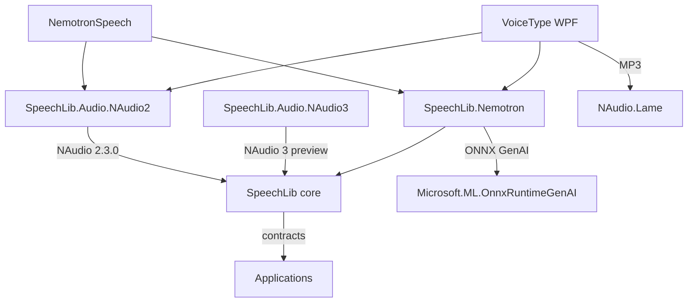

# Nemotron ASR .NET 🎙️

Real-time multilingual speech recognition using [NVIDIA Nemotron 3.5 ASR](https://huggingface.co/nvidia/nemotron-3.5-asr-streaming-multilingual-0.6B) (0.6B params) via ONNX Runtime GenAI in C#.

| Feature | Details |
|---------|---------|
| **Languages** | 100+ (auto-detect or BCP-47 code) |
| **Modes** | File, microphone, system loopback, mic+loopback mix |
| **VAD** | Silero VAD — cuts CPU from 58% → 7% in silence |
| **Providers** | CUDA, CPU, DirectML — switchable at runtime |
| **Architecture** | KISS + SOLID, lock-free audio pipeline |

---

## Solution Structure

```
nemotron-speech-csharp/
├── NemotronSpeech.slnx           # .NET 10 solution file
├── SpeechLib/                    # 📚 Provider-neutral speech contracts
├── SpeechLib.Nemotron/           # 🧠 Nemotron ONNX Runtime provider
├── SpeechLib.Audio.NAudio2/      # 🎙️ Stable NAudio 2 audio provider
├── SpeechLib.Audio.NAudio3/      # 🎙️ NAudio 3 preview audio provider
├── NemotronSpeech/               # 🎙️ Nemotron ONNX GenAI recognizer (CLI + engine)
├── VoiceType/                    # 🖥️ WPF desktop app (streaming dictation)
├── converter/                    # 🐍 Python model converter (NeMo → ONNX)
├── modules/                      # 🧠 Ready models by module (git-ignored)
│   ├── asr/                      #    ASR models (cpu, cpu-ru-en, qnn, ...)
│   ├── diarization/              #    Sortformer diarization models
│   └── denoise/                  #    DeepFilterNet3 denoise model
├── work/                         # 🛠️ Temp/intermediate conversion artifacts (git-ignored)
└── Test-Audio/                   # 🎵 Test audio files
```

## Projects

| Project | Type | Description |
|---------|------|-------------|
| [**SpeechLib**](SpeechLib/README.md) | .NET 10 Library | Provider-neutral interfaces, bounded audio queues, capture lifecycle, and `LiveTranscriber` |
| **SpeechLib.Nemotron** | .NET 10 Library | NVIDIA Nemotron ONNX Runtime GenAI recognizer provider |
| **SpeechLib.Audio.NAudio2** | .NET 10 Library | Stable NAudio 2.3.0 microphone, loopback, mix, and file provider |
| **SpeechLib.Audio.NAudio3** | .NET 10 Windows Library | NAudio 3.0.0-preview.19 microphone, loopback, and mix provider |
| [**NemotronSpeech**](NemotronSpeech/README.md) | .NET 10 Console App | ONNX Runtime GenAI implementation of `IStreamingSpeechRecognizer` for NVIDIA Nemotron 3.5 ASR. Supports CUDA / CPU / DirectML. |
| [**VoiceType**](VoiceType/README.md) | .NET 10 WPF App | Desktop speech-to-text with global hotkeys, text injection into any app, session recording, post-processing pipeline, MP3 audio saving |

## Quick Start

### Prerequisites
- [.NET 10 SDK](https://dotnet.microsoft.com/download/dotnet/10.0)
- Windows 10/11
- Microphone

### CPU only (any machine)
```powershell
dotnet build NemotronSpeech.slnx -c Release -p:GpuArch=CPU
dotnet run --project VoiceType -c Release
```

### RTX 20 / 30 / 40 (CUDA)
```powershell
dotnet build NemotronSpeech.slnx -c Release
dotnet run --project VoiceType -c Release
```

### RTX 50 (Blackwell)
```powershell
dotnet build NemotronSpeech.slnx -c Release -p:GpuArch=Blackwell
dotnet run --project VoiceType -c Release
```

## Build Configurations

| Command | Target GPU | ORT GenAI | CUDA |
|---------|------------|-----------|------|
| `dotnet build -c Release` | RTX 20/30/40, GTX 16 | 0.15.0 stable | 12.x |
| `dotnet build -c Release -p:GpuArch=Blackwell` | RTX 50 (Blackwell) | nightly | 13.x |
| `dotnet build -c Release -p:GpuArch=CPU` | No GPU | 0.15.0 CPU | — |
| `dotnet build -c Release -p:GpuArch=DML` | Any GPU (DirectX) | 0.14.1 DML | — |

## Dependencies Graph


```mermaid
graph TD
  SL[SpeechLib core] --> |contracts| APP[Applications]
  NA2[SpeechLib.Audio.NAudio2] --> |NAudio 2.3.0| SL
  NA3[SpeechLib.Audio.NAudio3] --> |NAudio 3 preview| SL
  NM[SpeechLib.Nemotron] --> |ONNX GenAI| ORT[Microsoft.ML.OnnxRuntimeGenAI]
  NM --> SL
  CLI[NemotronSpeech] --> NM
  CLI --> NA2
  VT[VoiceType WPF] --> NM
  VT --> NA2
    VT --> |MP3| LAME[NAudio.Lame]
```

The core assembly does not reference NAudio or ONNX Runtime. Audio providers are Windows-specific; the core contracts can be used on other platforms with an application-supplied `IAudioSource`.

### NAudio 3 preview

The preview provider is opt-in and is not the default for CLI, WPF, or WinUI applications. To evaluate it, reference `SpeechLib.Audio.NAudio3`, create an `NAudio3AudioSourceFactory`, and pass its source to `LiveTranscriber.Run`. See [SpeechLib.Audio.NAudio3 README](SpeechLib.Audio.NAudio3/README.md).

## CLI Usage (NemotronSpeech)

```powershell
# Microphone with VAD, Russian
dotnet run --project NemotronSpeech -c Release -- "modules/asr/cpu" --mic cpu --language ru --use_vad true

# Audio file
dotnet run --project NemotronSpeech -c Release -- "modules/asr/cpu" "audio.wav" cpu --language en

# Audio file with word-level timestamps
dotnet run --project NemotronSpeech -c Release -- "modules/asr/cpu" "audio.wav" cpu --word-timestamps

# System audio loopback
dotnet run --project NemotronSpeech -c Release -- "modules/asr/cpu" --loopback cpu
```

### Word Timestamps (`--word-timestamps`)

File-mode only. Outputs each word with its `[start → end]` time in seconds:

```
============================================================
  Perhaps he made up to the party afterwards and took her...
============================================================

  Word timings (25 words):
------------------------------------------------------------
  [0.56s -> 1.00s] Perhaps
  [1.00s -> 1.12s] he
  [1.12s -> 1.40s] made
  ...
```

| Aspect | Detail |
|--------|--------|
| **Granularity** | ~560ms per chunk, refined by token-count weighting |
| **Punctuation** | Merged into preceding word (no standalone `.` or `,` entries) |
| **Language tags** | `<en-US>`, `<de-DE>` etc. filtered from timing output |
| **Time distribution** | Weighted by estimated token count per word (Phase 2) |
| **Model** | `SpeechLib/Models/WordTiming.cs` — `Word`, `StartSeconds`, `EndSeconds` |
| **CLI flag** | `--word-timestamps` (ignored in live/mic mode) |

## Model Conversion

See [converter/README.md](converter/README.md) for Python model conversion (NeMo → ONNX). Available presets:

| Variant | Encoder | Size | Target |
|---------|---------|------|--------|
| `gpu-cuda` | INT8 | ~1021 MB | NVIDIA GPU |
| `cpu` | INT4 | ~757 MB | Any CPU |
| `gpu-dml` | INT8 | ~1021 MB | DirectML GPU |

---

### 📖 Detailed Documentation
- [SpeechLib README](SpeechLib/README.md) — library architecture & extensibility
- [NemotronSpeech README](NemotronSpeech/README.md) — model setup, GPU configs, CLI args
- [VoiceType README](VoiceType/README.md) — desktop app features & settings

### Language Codes (common)
`en` `ru` `zh` `de` `fr` `es` `ja` `ko` `hi` `ar` `pt` `it` `nl` `pl` `tr` `uk` `sv` `da` `fi` `no` `cs` `hu` `ro` `el` `th` `vi` `he` `auto`

---

## Performance

### CPU INT4/INT8 benchmark

`BenchmarkSuite1` compares the shipped `models-onnx/cpu-fp32`,
`cpu-int8`, and `cpu-int4` artifacts on `Test-Audio/sample-0.mp3`.
The benchmark reports steady-state real-time factor (RTF) and memory
diagnostics; transcripts are written to the ignored `build/benchmark-results/`
directory for manual WER comparison against a trusted reference.

```powershell
dotnet run --project BenchmarkSuite1 -c Release --no-restore -- --filter "*TranscribeSampleRtf*"
```

Model construction is intentionally outside the timed method, so these results
measure inference throughput rather than startup time.

Measured on Ryzen 9 + RTX 5070 Ti Laptop (Blackwell, 20 cores):

| Mode | CPU idle | CPU speech | GPU | VRAM | Tokens |
|------|----------|------------|-----|------|--------|
| CUDA | 64% | 64% | 15% | 668 MB | ~1.1s |
| CUDA + VAD | 64% | 70% | 15% | 668 MB | ~1.1s |
| CPU | 58% | 58% | — | — | ~1.1s |
| **CPU + VAD** ✅ | **7%** | 25% | — | — | ~1.1s |

> ORT spawns one spin-wait thread per CPU core (~20 threads). The 60%+ "CPU usage" is idle spin, not real work. VAD skips inference on silence → average CPU drops to 7%.

---

## Architecture

```
Mic/Loopback ──→ selected NAudio provider ──→ bounded ConcurrentQueue<float[]> (batched)
                                          │
                                          ▼
                                   StreamingProcessor
                                     │          │
                                Silero VAD     Encoder (INT4/INT8)
                                     │          │
                                     ▼          ▼
                                  Generator ← Joint (RNNT)
                                     │
                                     ▼
                                TokenizerStream → Console
```

**Files (SOLID):**

| File | Responsibility |
|------|---------------|
| `Program.cs` | Entry point, DI wiring |
| `AppOptions.cs` | CLI parsing |
| `LanguageMapper.cs` | BCP-47 → lang_id |
| `ModelSession.cs` | ORT model lifecycle |
| `WordTiming.cs` | Word + start/end time record |
| `IAudioSourceFactory` | Provider-neutral source construction contract |
| `LiveTranscriber.cs` | Provider-neutral live capture orchestration |
| `Transcriber.cs` | File orchestration and compatibility API |

---

## License

MIT — see [LICENSE](converter/LICENSE)
