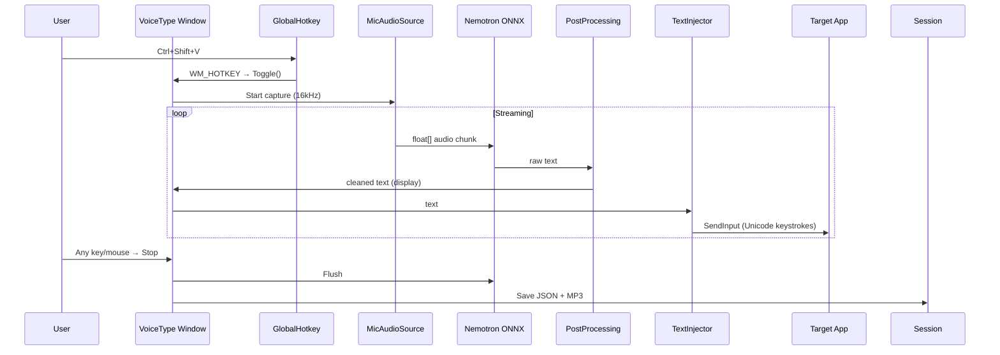

# VoiceType 🖥️

Windows desktop application for streaming speech-to-text dictation. Speaks into any application — text appears in the focused input field.

## Features

| Feature | Description |
|---------|-------------|
| 🎤 **Streaming ASR** | Real-time transcription via Nemotron ONNX engine |
| ⌨️ **Global hotkey** | `Ctrl+Shift+V` (configurable) to toggle recognition from any app |
| 📝 **Text injection** | Recognized text appears in the previously focused input field (SendInput / Clipboard) |
| 🛑 **Auto-stop** | Any keyboard or mouse press stops recognition |
| 🪟 **Floating window** | Always-on-top window showing live transcription |
| 💾 **Session recording** | Save recognition sessions as JSON metadata |
| 🎵 **MP3 audio save** | Record microphone audio as MP3 (NAudio + LAME) |
| 🔧 **Post-processing** | Regex pipeline to clean artifacts (configurable) |
| 🌍 **100+ languages** | BCP-47 language selection via settings |
| ⚙️ **Full settings UI** | Model path, EP, VAD, capture mode, all configurable |

## Structure

```
VoiceType/
├── Models/
│   ├── AppSettings.cs              # All settings (engine, sessions, post-processing, hotkey)
│   └── RecognitionSession.cs       # Session metadata model
├── Services/
│   ├── RecognitionService.cs       # Wraps IStreamingSpeechRecognizer → event-driven API
│   ├── AudioRecorderService.cs     # MP3 audio recording (NAudio + LAME)
│   ├── GlobalInputHook.cs          # Low-level keyboard/mouse hooks (P/Invoke SetWindowsHookEx)
│   ├── GlobalHotkeyService.cs      # System-wide hotkey (RegisterHotKey WinAPI)
│   ├── TextInjector.cs             # SendInput (Unicode) / Clipboard paste
│   ├── SessionManager.cs           # JSON session persistence
│   ├── PostProcessingPipeline.cs   # Regex-based text cleanup
│   └── SettingsService.cs          # JSON settings load/save
├── ViewModels/
│   ├── MainViewModel.cs            # Main window MVVM
│   ├── SettingsViewModel.cs        # Settings window MVVM
│   └── Commands.cs                 # RelayCommand / RelayCommand<T>
├── Views/
│   ├── MainWindow.xaml/.cs         # Floating always-on-top window
│   └── SettingsWindow.xaml/.cs     # Full settings editor
├── App.xaml/.cs                    # Application entry, error handlers, dark theme
└── VoiceType.csproj                # .NET 10 WPF, WinExe
```

## How It Works



## Settings

### Speech Engine
- **Model Path** — path to ONNX model folder
- **Execution Provider** — `cpu` / `cuda` / `dml` / `follow_config`
- **Language** — BCP-47 code (e.g. `ru`, `en-US`, `auto`)
- **Use VAD** — Silero Voice Activity Detection

### Audio Capture
- **Audio Source** — `Mic` / `Loopback` / `Mix`

### Text Injection
- **Injection Method** — `SendInput` (Unicode) or `Clipboard` (Ctrl+V)
- **Stop on any input** — auto-stop on keyboard/mouse

### Session Recording
- **Save sessions** — enable/disable
- **Sessions path** — where to store JSON + MP3 files
- **Save audio as MP3** — record microphone to MP3

### Global Hotkeys
- **Toggle Recognition** — default `Ctrl+Shift+V`

### Post-Processing Pipeline
- **Enable post-processing** — on/off
- **Rules** — regex find-and-replace rules (add/edit/delete)

Default rules:
| Name | Pattern | Replacement |
|------|---------|-------------|
| Strip repeated punctuation | `([,.!?;:])\1+` | `$1` |
| Remove hesitation markers | `\b(uh+\|um+\|er+)\b` | *(empty)* |
| Normalise whitespace | `\s{2,}` | ` ` |

## Running

```powershell
# Ensure model is available at modules/asr/cpu/
dotnet build NemotronSpeech.slnx -c Release -p:GpuArch=CPU
dotnet run --project VoiceType -c Release
```

Settings are stored at `%LocalAppData%\VoiceType\settings.json`.

Sessions are stored at `%LocalAppData%\VoiceType\Sessions\` (configurable).

## Dependencies

| Package | Version | Purpose |
|---------|---------|---------|
| NAudio | 2.2.1 | Audio capture |
| NAudio.Lame | 2.1.0 | MP3 encoding |
| SpeechLib | Project ref | Recognition abstractions |
| NemotronSpeech | Project ref | ONNX GenAI engine |
| .NET 10 WPF | — | UI framework |
