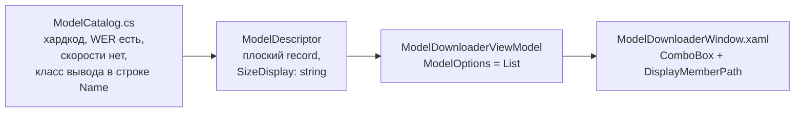
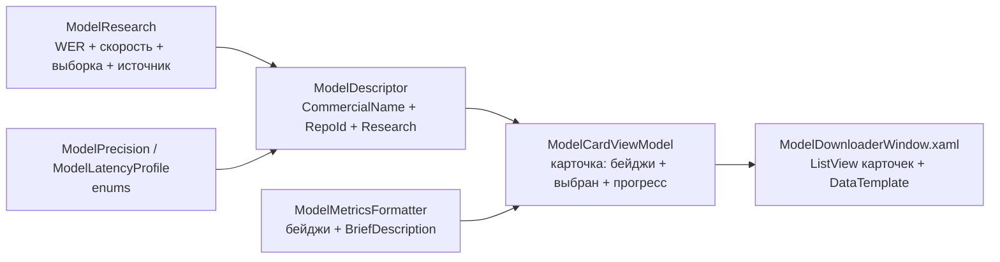

# VoiceType.WinUI — Model Download Manager Redesign

**Branch:** `feature/winui-model-downloader` (to be created)
**Date:** 2026-08-28
**Status:** Planning (not implemented)

---

## Цель

Переосмыслить окно «Model downloader» и выбор модели в настройках VoiceType.WinUI так, чтобы пользователь **сразу** видел по каждой модели:

1. **Коммерческое название** — оригинальное имя модели: `Nemotron 3.5 ASR`, `Parakeet TDT 0.6B v3`.
2. Краткое описание (tagline)
3. Протестированный WER (общий + разбивка ru/en)
4. Примерную скорость (× real-time)
5. Размер
6. Класс вывода: «чистый реалтайм» (стриминг частичных результатов) или «вывод с задержкой» (финализация по паузе/концу фразы)

При этом **каждая модель хранит структурированные данные исследований** (WER, скорость, выборка, источник), а не строку. Если тестов по модели нет — показываем «нет тестов», не выдумываем числа.

Сейчас всё это либо спрятано за `ComboBox` (видна одна строка `Name · Size`), либо размазано строками по `Name`/`Description`; в настройках выбор идёт по имени папки без привязки к описанию.

---

## Текущее состояние (AS-IS)



Окно сегодня — это `ComboBox` (`DisplayMemberPath="DisplayName"`), поле пути и два прогрессбара. Пользователь не видит ни описания, ни WER, ни скорости — только `"Nemotron 3.5 ASR · INT4 · 0.56s — Low latency · 757 MB"`.

### Code smells (по каталогу refactoring.guru)

| Smell | Локация | Impact | Refactoring |
|---|---|---|---|
| **Primitive Obsession** | `ModelDescriptor.Description`, `SizeDisplay`, `Precision: string`, `WerPercent: double?` | Смысловые данные (точность, скорость, размер, класс вывода) размазаны строками; нельзя отрисовать бейджи/сортировать | Introduce Value Objects (`WerMetrics`, `SpeedMetrics`), enums |
| **Data Clumps** | `Description` = «WER … + размер + точность + языки» в одной строке | WER и скорость всегда идут парой, но хранятся раздельно/строкой | Parameter Object |
| **Stringly-typed UI** | `Name` содержит «Low latency / Recommended / Best accuracy» | Невозможно локализовать, стилизовать, фильтровать | Enums + presentation layer |
| **Speculative/Duplicate Data** | WER в `ModelCatalog` дублирует `build/wer-reports/*-lc56.md`, но скорость (RTF) из отчётов не перенесена | Данные расходятся; нет единого источника | Один источник — каталог, заполненный из отчётов |
| **Drift в Recommended** | `MainViewModel.RecommendedModelRepo` = `…int4-opset24-c056-cpu`, а в `ModelCatalog` такой модели нет | `SelectedModel` падает в `FirstOrDefault()` → открывается FP32 2.4 ГБ, а не рекомендуемая INT4 | Унифицировать источник recommended |
| **Нет коммерческого имени** | `Name` — техническая строка («…INT4 · 0.56s — Low latency»), а не оригинальное имя модели | Пользователь не понимает, что выбрать | Вынести `CommercialName` = оригинальное имя (`Nemotron 3.5 ASR` / `Parakeet TDT 0.6B v3`); точность/окно — отдельными полями |
| **Разрыв settings ↔ каталог** | `SettingsViewModel.AvailableModels` — список имён папок (`string`), без привязки к `ModelDescriptor` | В настройках нельзя показать название/скорость/качество выбранной модели | `ModelCatalog.FindBySubfolder(...)` + info-панель |

---

## Целевая архитектура (TO-BE)

### Принципы

1. **Данные отдельно от представления.** `ModelDescriptor` — чистые данные без UI-строк. Все бейджи/форматирование — на стороне ViewModel/конвертеров.
2. **Enums вместо строк** для `Precision` и класса вывода.
3. **Value objects** для метрик (WER, скорость) — они всегда идут вместе.
4. **Одна модель = одна карточка** в списке; выбор и прогресс — явные состояния.
5. **Не выдумывать тесты.** Нет замеров WER/скорости → показываем «нет тестов», а не примерные числа.
6. **Коммерческое имя = оригинальное имя модели** (`Nemotron 3.5 ASR`, `Parakeet TDT 0.6B v3`); точность/окно/квант — структурированные атрибуты, а не часть имени.



---

## Модель данных

### 1. Enums (SpeechLib.ModelDownload)

```csharp
public enum ModelPrecision { Fp32, Int8, Int4 }

/// <summary>Как пользователь получает текст.</summary>
public enum ModelLatencyProfile
{
    /// <summary>Частичные результаты появляются по мере речи (около-нулевая задержка).</summary>
    Streaming,
    /// <summary>Текст финализируется по концу фразы/паузе.</summary>
    Delayed
}
```

### 2. Value objects (SpeechLib.ModelDownload)

```csharp
public sealed record WerMetrics(double TotalPercent, double? RuPercent = null, double? EnPercent = null);

public sealed record SpeedMetrics(double RealTimeFactor, double SpeedMultiplier)
{
    public bool IsRealtimeCapable => RealTimeFactor < 1.0;
}
```

`SpeedMultiplier` = 1 / RTF (напр. RTF 0.132 → ≈7.6×). Значение «× real-time» — это то, что пользователь видит как «примерная скорость».

### 3. `ModelResearch` — структурированные результаты исследований

Всё, что мы **знаем и измерили** по модели, хранится в одном месте. Ничего не
додумываем: поле `null` = тест не проводился.

```csharp
public sealed record ModelResearch(
    WerMetrics? Wer = null,      // null → тестов качества нет
    SpeedMetrics? Speed = null,  // null → тестов скорости нет
    string? Dataset = null,      // напр. "Common Voice 17 (ru 250 + en 250)"
    string? Source = null)       // напр. "build/wer-reports/cpu-int4-c112-lc56.md"
{
    public bool HasWer => Wer is not null;
    public bool HasSpeed => Speed is not null;
    public bool HasAnyData => HasWer || HasSpeed;
}
```

### 4. `ModelDescriptor` (расширение record)

Текущий плоский record расширяется **аддитивно**; единственный ломающий элемент —
переименование `Name` → `CommercialName` (Uno использует `.Name` в одной строке —
обновить её).

```csharp
public sealed record ModelDescriptor(
    string CommercialName,       // оригинальное имя модели: "Nemotron 3.5 ASR", "Parakeet TDT 0.6B v3"
    string RepoId,               // технический идентификатор HF
    string Tagline,              // одна строка-хук
    string Description,          // развёрнутое описание
    long SizeBytes,              // было SizeDisplay: string
    ModelPrecision Precision,    // Fp32 / Int8 / Int4
    string? ContextWindow,       // напр. "0.56s" / "1.12s" (для Nemotron)
    ModelLatencyProfile Latency, // как работает: стриминг vs финал по паузе
    ModelResearch Research,      // структурированные тесты (см. выше)
    string? QuantizationFolder = null,
    bool IsRecommended = false)
{
    public string SubfolderName { get; } // без изменений
}
```

**Разделение обязанностей:**
- `CommercialName` — оригинальное имя модели (что видит пользователь).
- `RepoId` / `SubfolderName` — техническая идентификация (скачивание, папки, settings).
- `Precision` + `ContextWindow` — характеристики, которые раньше были зашиты в `Name`.
- `Research` — факты замеров; при отсутствии данных содержит `null`-метрики, а UI
  выводит «нет тестов» (не выдумывает).

`DisplayName`/`ToString` остаются как legacy-строка (коммерческое имя + размер) для
списков и логов; WinUI-окно для карточек их не использует.

---

## Классификация «реалтайм vs задержка»

Два **независимых** измерения — их нельзя смешивать:

| Ось | Источник | Что показываем |
|---|---|---|
| **Скорость вычислений** | RTF из `wer-reports/*-lc56.md` | `≈7.6× real-time` (во сколько раз быстрее реального времени) |
| **Класс вывода** | Природа декодера | `Streaming` (частичные по мере речи) vs `Delayed` (финал по паузе) |

Правило «чистый реалтайм»: `SpeedMultiplier ≥ 1` **и** `Latency == Streaming`.
Если `SpeedMultiplier < 1` — модель не успевает за речью в реальном времени (для CPU-диктовки
это критично), показываем предупреждение, а не бейдж «реалтайм».

---

## Заполнение каталога измеренными данными

Источник — `build/wer-reports/*-lc56.md` (соответствуют рантайм-конфигу приложения `left_context=56`).

| CommercialName | Repo суффикс / folder | Precision | Context | WER (ru/en) | Speed | Size | Latency |
|---|---|---|---|---|---|---|---|
| Nemotron 3.5 ASR | `…int4-c056-cpu` | Int4 | 0.56s | 20.25% (16.78/23.44) | 4.4× | 757 MB | Streaming |
| Nemotron 3.5 ASR | `…int4-c112-cpu` | Int4 | 1.12s | 19.21% (15.72/22.41) | **7.6×** | 757 MB | Streaming |
| Nemotron 3.5 ASR | `…fp32-c056-cpu` | Fp32 | 0.56s | 17.89% (13.78/21.66) | 4.8× | 2,479 MB | Streaming |
| Nemotron 3.5 ASR | `…fp32-c112-cpu` | Fp32 | 1.12s | **16.71%** (12.52/20.55) | 3.8× | 2,479 MB | Streaming |
| Parakeet TDT 0.6B v3 | `parakeet-tdt…/int4` | Int4 | — | нет тестов | нет тестов | 730 MB | Delayed* |
| Parakeet TDT 0.6B v3 | `parakeet-tdt…/int8` | Int8 | — | нет тестов | нет тестов | 670 MB | Delayed* |
| Parakeet TDT 0.6B v3 | `parakeet-tdt…/fp32` | Fp32 | — | 8.19% (5.90/10.30) | 3.7× | 2,550 MB | Delayed* |

\* Parakeet TDT финализирует результат по blank-сегментации фразы — относим к `Delayed`
(точный класс подтвердить по `ParakeetTdtRecognizer` / `blank-based endpointing`).
WER/RTF для int4/int8 Parakeet ещё не измерены — в `ModelResearch` они `null`,
в UI показываем «нет тестов» (без выдуманных чисел).

> ⚠️ **Расхождение recommended**: `MainViewModel.RecommendedModelRepo` указывает на
> `…int4-opset24-c056-cpu`, которого нет в `ModelCatalog`. Нужно решить, какая INT4
> является рекомендуемой (opset24 vs обычный), и выровнять оба места через
> `ModelCatalog.Recommended.RepoId`.

---

## UI: карточки вместо ComboBox

`ModelDownloaderWindow.xaml` — заменить секцию «Select Model» на `ListView`
(или `ItemsRepeater` в `ScrollViewer`) с `DataTemplate` карточки. Каждая карточка:

```
┌───────────────────────────────────────────────────────┐
│ Nemotron 3.5 ASR                          [Recommended]│
│ 4-bit квант, лучший баланс размер/точность              │
│                                                        │
│  WER 19.2%   ≈7.6× real-time   757 MB   Real-time      │
│  (ru 15.7 / en 22.4)                                   │
│                                              [Download]│
└───────────────────────────────────────────────────────┘
```

- **Название** — `Name` (полужирный).
- **Tagline** — одна строка серым.
- **Бейджи** — `WER`, `Speed`, `Size`, `Latency`; последние два — `Border` с подложкой.
- **Recommended** — флаг `IsRecommended` → акцентная плашка.
- **Выбор** — клик по карточке = выбор; `ListView.SelectedItem` ↔ `SelectedModel`.
- **Download** — на карточке (или общая кнопка внизу). Пока идёт загрузка — прогресс в карточке.

Все биндинги на read-only свойства — **`Mode=OneWay`** (критичный pitfall из AGENTS.md).

### MVVM-структура

- `ModelDownloaderViewModel`:
  - `IReadOnlyList<ModelCardViewModel> Models` — карточки.
  - `ModelCardViewModel? SelectedModel` — выбранная карточка.
  - Прогресс/статус — как сейчас, но привязанные к выбранной карточке.
- `ModelCardViewModel` (обёртка над `ModelDescriptor`):
  - Композиция: `Descriptor` + вычисляемые строки бейджей (`WerBadge`, `SpeedBadge`,
    `SizeBadge`, `LatencyBadge`, `LatencyGlyph`, `IsRecommended`).
  - Не наследуется от `ModelDescriptor` (композиция вместо наследования — record sealed).
- `ModelMetricsFormatter` (static, SpeechLib.ModelDownload) — единое форматирование
  WER/скорости/размера; переиспользует `ModelDownloaderService.FormatSize` (перенести/обернуть).

> Простая альтернатива без обёртки: биндить карточку прямо на `ModelDescriptor` +
> `IValueConverter` для бейджей. Выбираем обёртку — она тестируема без XAML и даёт
> место для per-card прогресса, но если прогресс останется общим на всё окно, конвертеры
> проще (KISS).

### Краткая информация в настройках (Settings)

При выборе модели в `SettingsWindow` под ComboBox показываем сводку «как модель
работает + скорость + качество» из `Research`:

> **Nemotron 3.5 ASR** (INT4 · 1.12s) — стриминг: текст появляется по мере речи.
> Скорость ≈7.6× real-time · Качество WER 19.2% (ru 15.7 / en 22.4)
> Выборка: Common Voice 17 (ru 250 + en 250)

Без тестов или для неизвестной (кастомной) папки — честно, без выдумок:

> **unknown-model** — данные о тестах отсутствуют.

Реализация:
- `ModelCatalog.FindBySubfolder(string folderName)` → `ModelDescriptor?`
  (по `SubfolderName`, case-insensitive).
- `SettingsViewModel.SelectedModelInfo` — строка, обновляется в `OnSelectedModelChanged`;
  неизвестная модель → «Модель не из каталога — тесты неизвестны».
- `ModelMetricsFormatter.BriefDescription(ModelDescriptor)` — собирает сводку,
  заменяя отсутствующие метрики на «нет тестов».

---

## Файлы для изменения

| Файл | Изменение |
|---|---|
| `libraries/SpeechLib/src/SpeechLib.ModelDownload/ModelDescriptor.cs` | +enums, +value objects, +`ModelResearch`; `Name`→`CommercialName`, +`ContextWindow`, +`Research` |
| `libraries/SpeechLib/src/SpeechLib.ModelDownload/ModelCatalog.cs` | переписать каталог: коммерческие имена + измеренные WER/RTF/size; +`FindBySubfolder` |
| `libraries/SpeechLib/src/SpeechLib.ModelDownload/ModelMetricsFormatter.cs` | новый: `BriefDescription` + форматирование бейджей, «нет тестов» для null-метрик |
| `apps/VoiceType.WinUI/.../ViewModels/ModelCardViewModel.cs` | новый: обёртка карточки |
| `apps/VoiceType.WinUI/.../ViewModels/ModelDownloaderViewModel.cs` | список карточек, выбор, прогресс |
| `apps/VoiceType.WinUI/.../Views/ModelDownloaderWindow.xaml(.cs)` | ListView карточек вместо ComboBox; увеличить окно |
| `apps/VoiceType.WinUI/.../ViewModels/SettingsViewModel.cs` | `SelectedModelInfo` + `FindBySubfolder` для сводки |
| `apps/VoiceType.WinUI/.../Views/SettingsWindow.xaml` | info-панель под ComboBox модели |
| `apps/VoiceType.WinUI/.../ViewModels/MainViewModel.cs` | `RecommendedModelRepo` → `ModelCatalog.Recommended.RepoId` |
| `apps/VoiceType.Uno/.../DownloadQueueService.cs` | обновить `.Name` → `.CommercialName` (одна строка) |

> Uno: единственное изменение — `.Name` → `.CommercialName` в `DownloadQueueService`
> (дисплей-имя элемента очереди). Остальные поля аддитивны.

---

## Порядок работы

1. **Ветка**: `git checkout -b feature/winui-model-downloader`.
2. **Data layer** (SpeechLib.ModelDownload): enums + value objects + `ModelResearch`;
   `Name`→`CommercialName` + `ContextWindow`; обновить `ModelCatalog` (имена + замеры);
   обновить `.Name` → `.CommercialName` в Uno `DownloadQueueService`.
   Сборка: `dotnet build NemotronSpeech.slnx -c Debug -p:GpuArch=CPU`.
3. **Formatter** + unit-проверка (`BriefDescription`, «нет тестов», размер, ×, WER-строка).
4. **WinUI VM**: `ModelCardViewModel` + переработка `ModelDownloaderViewModel`.
5. **WinUI XAML**: карточки + окно; `Mode=OneWay` для read-only биндингов.
6. **Settings**: `SelectedModelInfo` + info-панель в `SettingsWindow`.
7. **Выравнивание recommended** в `MainViewModel`.
8. **Сборка WinUI**: `dotnet build apps/VoiceType.WinUI/src/VoiceType.WinUI/VoiceType.WinUI.csproj -c Debug -p:GpuArch=CPU`.
9. `git diff --check`; ручной прогон окна.

---

## Риски и допущения

- **Неполные данные Parakeet int4/int8** — нет WER/RTF. В `ModelResearch` они `null`;
  UI показывает «нет тестов». Позже можно замерить и заполнить.
- **Расхождение recommended (opset24)** — требует решения владельца, какая INT4
  рекомендована; не менять молча.
- **Кастомные модели в настройках** — папка без записи в каталоге: показываем имя
  папки + «тесты неизвестны», не пытаемся угадать.
- **Переименование `Name` → `CommercialName`** — затрагивает Uno `DownloadQueueService`
  (одна строка); остальные поля аддитивны.
- **`HfFolder.Files` init-only и `Run.Text` DataContext** — при переносе прогресса в
  DataTemplate не нарушать существующие ограничения.
- **Размер окна** — карточки требуют больше высоты; пересмотреть `ApplyWindowSize`
  (600×372 → выше, напр. 640×720) и разрешить resize.
- **Локализация** — `CommercialName` остаётся как оригинальное имя (не переводим);
  бейджи/сводки переводимы отдельно.
